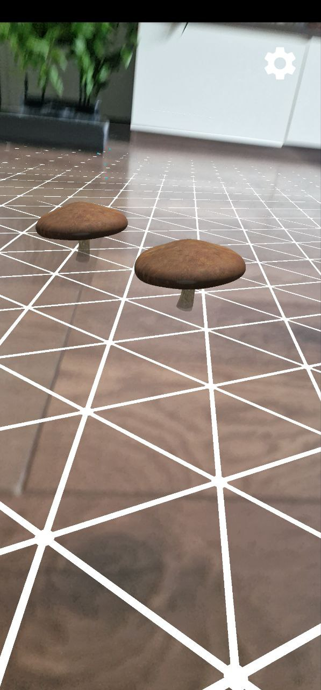
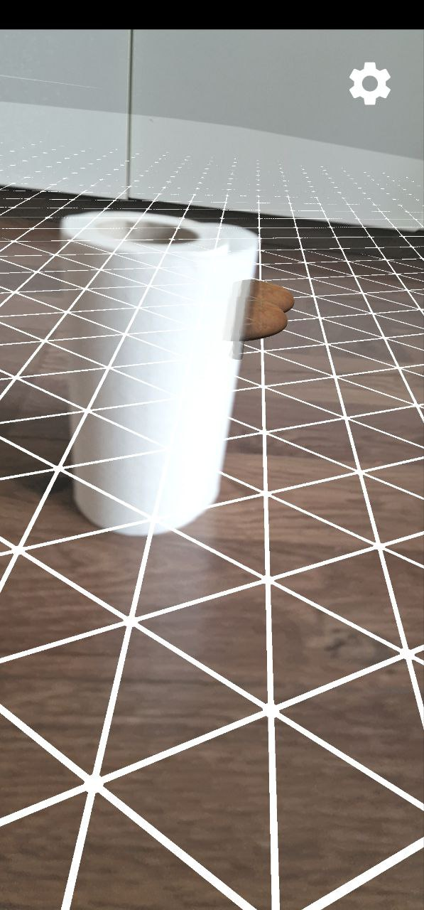
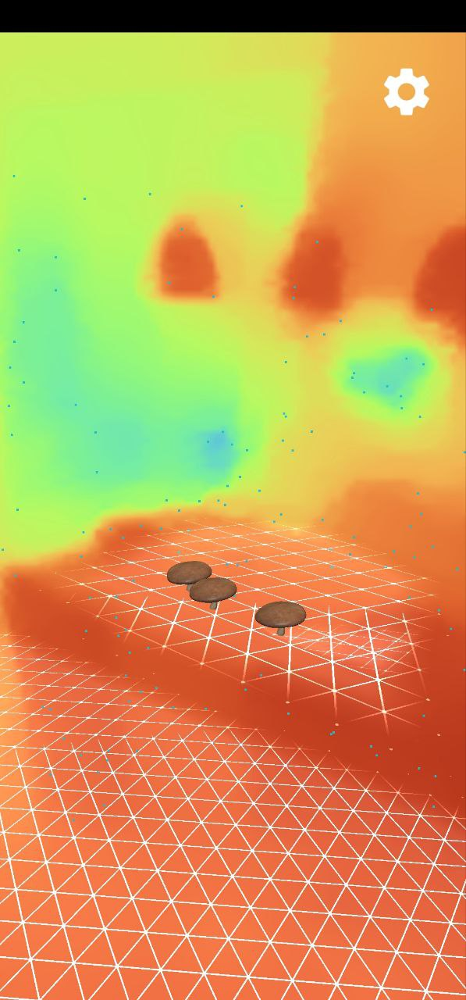

# Mushrooms AR 🍄

This AR (Augmented Reality) project allows users to place virtual 3D models of mushrooms in the real world using their mobile device's camera.

## Features

- Place 3D mushroom models in the real world using AR.
- Realistic shadows and lighting with environmental HDR.
- Depth map support for occlusion, making the mushrooms appear behind real-world objects.

## Screenshots

Here are some examples of what the app can do:

1. Mushrooms placed on the floor.

2. Mushrooms hiding behind a mask.

3. Depth map visualization.

## Getting Started

To get started with this project, clone the repository and open it in your favorite Android development environment. The project uses ARCore and Sceneform to render 3D models in the real world.

## Support

For support, please open an issue in the repository or contact the development team.

Enjoy placing mushrooms in the real world! 🍄🌍
